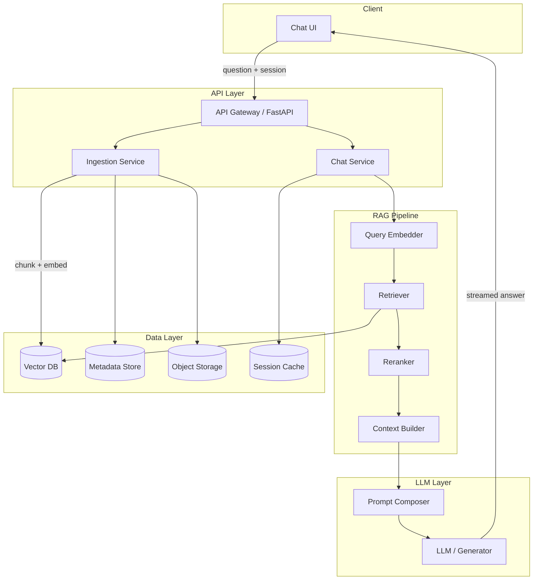
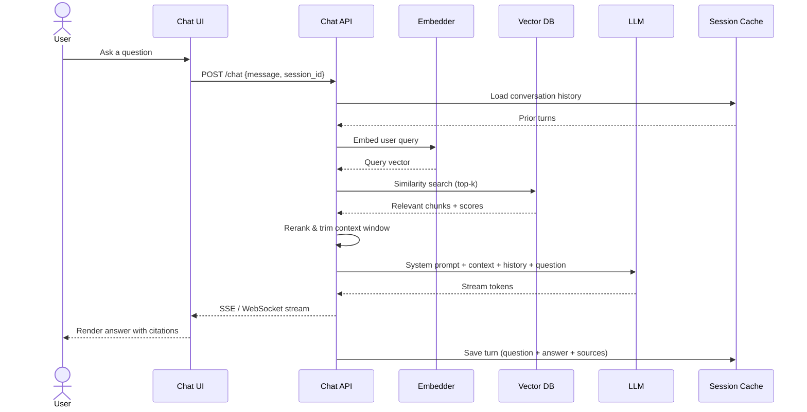
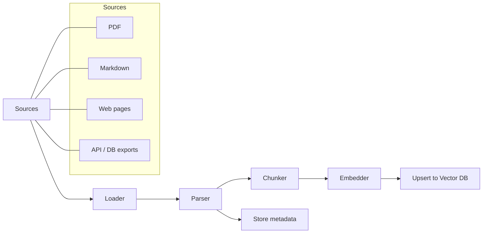
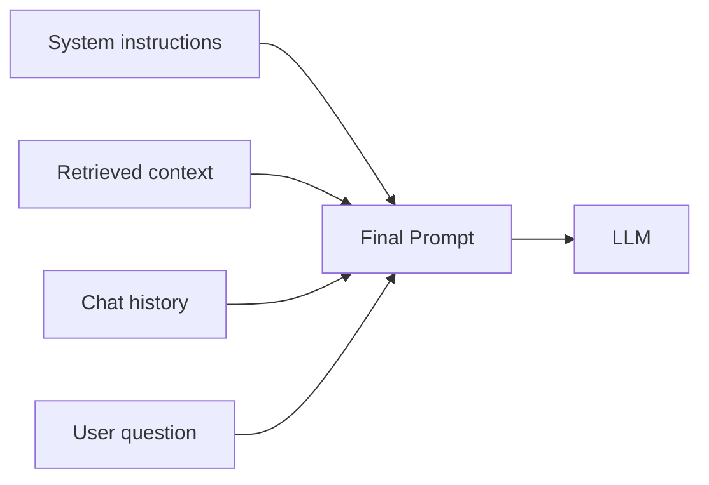
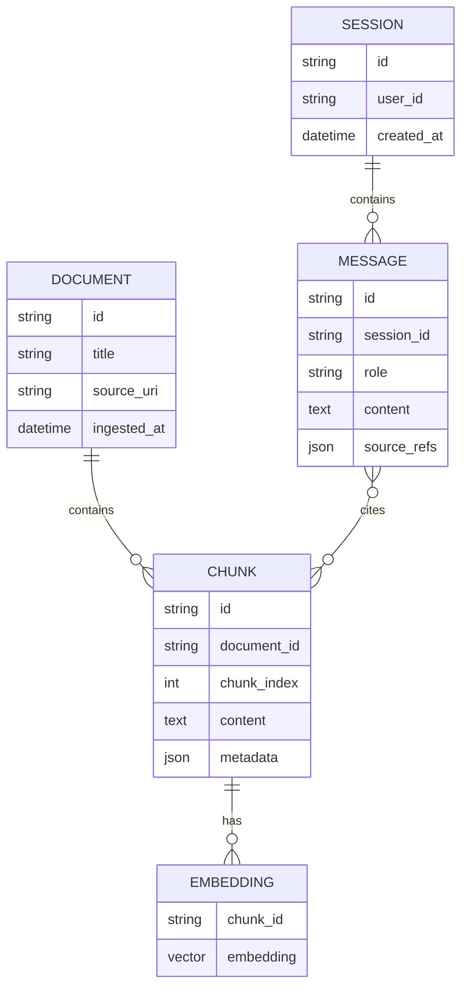
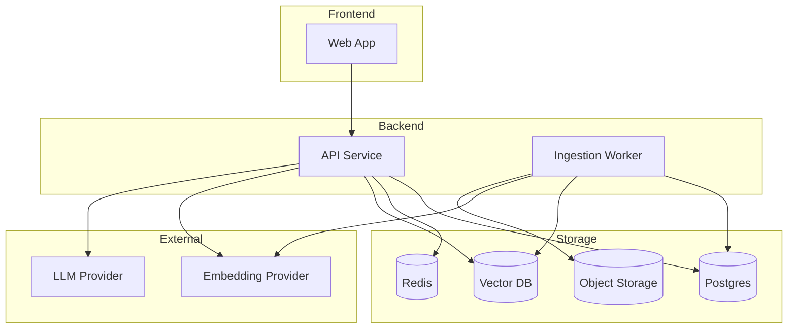

# agai

A RAG-based chat application that grounds LLM responses in your own documents.

## Overview

Users ask questions in a chat UI. The system retrieves relevant context from a vector store, augments the prompt, and streams an answer from an LLM. Documents are ingested separately through an indexing pipeline.

## High-Level Architecture

## Chat Request Flow

## Document Ingestion Pipeline

## Component Responsibilities

| Component | Role |
|---|---|
| **Chat UI** | Message input, streamed responses, source citations |
| **Chat API** | Orchestrates retrieval, prompting, and session state |
| **Ingestion Service** | Loads, chunks, embeds, and indexes documents |
| **Embedder** | Converts text to vectors (same model for ingest & query) |
| **Vector DB** | Stores embeddings; runs similarity search |
| **Reranker** | Re-scores retrieved chunks for relevance (optional) |
| **Context Builder** | Assembles top chunks within token budget |
| **LLM** | Generates the final grounded answer |
| **Session Cache** | Persists multi-turn conversation history |

## Prompt Composition

Typical structure:

1. **System** — answer only from provided context; cite sources; say "I don't know" when context is insufficient
2. **Context** — top-k retrieved chunks with document IDs
3. **History** — recent conversation turns
4. **User** — current question

## Data Model

## Deployment View

## Key Design Decisions

- **Same embedder for ingest and query** — ensures vectors live in the same semantic space
- **Chunk-level retrieval, document-level citations** — balance precision with readable source links
- **Streaming responses** — improves perceived latency for long answers
- **Session-aware history** — enables follow-up questions without re-sending full context each turn
- **Separate ingest path** — indexing is async and decoupled from the chat hot path

## Suggested Stack (reference)

| Layer | Options |
|---|---|
| API | FastAPI, Python |
| Vector DB | pgvector, Qdrant, Pinecone |
| LLM | OpenAI, Anthropic, local via Ollama |
| Embeddings | OpenAI, sentence-transformers |
| Object storage | S3, MinIO |
| Session store | Redis |
| Metadata | PostgreSQL |
